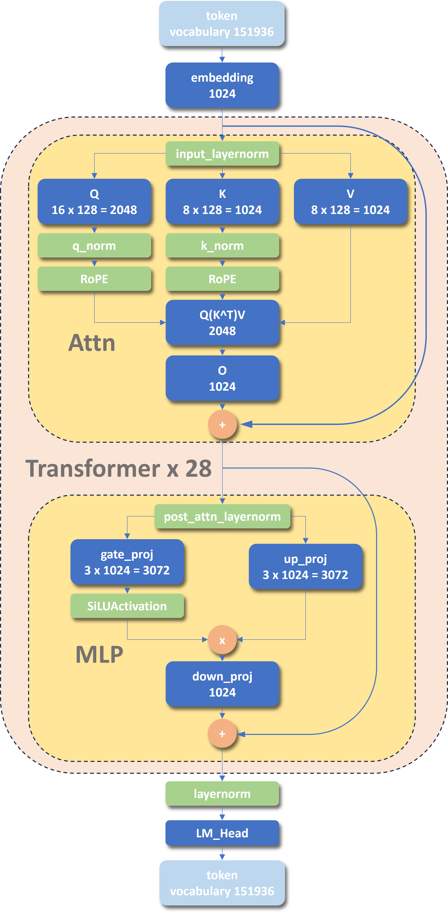

---
title: "qwen3-0.6B 学习笔记" 
date:  2026-01-30 
draft: false
tags:   [LLM, note]
math:  true
featuredImage: "img/cover.jpg"
---

## 0 Qwen3 Technical Report

> 原文: [Qwen3 Technical Report](https://arxiv.org/pdf/2505.09388)

Qwen3 稠密模型与 Qwen2.5 相似，共同特点是：

1. 分组查询头 (Grouped Query Attention, GQA) ，即多个 Q-head 共享同一组 KV 。
2. SwiGLU，替代了传统 transformer 中简单的 MLP 。
3. 旋转位置编码 (Rotary Positional Embeddings, ROPE) ，用于对 Q-head 和 K-head 注入位置信息。
4. RMSNorm，均方根归一化。
5. pre-norm，主要是针对残差连接的。数据输入后，先归一化，再进入模块计算，最后加上原始输入。与之相对的是 post-norm，表示数据输入后，先进入模块计算，再加上原始输入，最后统一归一化。pre-norm 可以避免训练时梯度消失。

不同点：

1. 溢出了 QKV-bias 。
2. 引入了 QK-Norm 。

主要参数：

| Models     | Layers | Heads(Q / KV) | Tie Embedding | Context Length |
| ---------- | ------ | ------------- | ------------- | -------------- |
| Qwen3-0.6B | 28     | 16 / 8        | Yes           | 32K            |

其中 Tie Embedding 表示  Embedding 和 解 Embedding 共享权重。

##  1 打印模型结构

可以使用 modelscope 上面的模型，无须代理或镜像，速度较快。需要按照 `modelscope` 和 `transformers` 库。

运行以下代码可得到模型的基本配置：

```python
from modelscope import AutoConfig, AutoModelForCausalLM
config = AutoConfig.from_pretrained("Qwen/Qwen3-0.6B")
print(config)
```

输出为：

```python
Qwen3Config {
  "architectures": [
    "Qwen3ForCausalLM"          # 因果语言模型
  ],
  "attention_bias": false,      # 无注意力偏置
  "attention_dropout": 0.0,
  "bos_token_id": 151643,       # 特殊 token: 句子开始标记
  "dtype": "bfloat16",          
  "eos_token_id": 151645,       # 特殊 token: 句子结束标记
  "head_dim": 128,              # 注意力头维度
  "hidden_act": "silu",         # 激活函数
  "hidden_size": 1024,          # 隐藏层大小
  "initializer_range": 0.02,    
  "intermediate_size": 3072,    # MLP 中间层大小, 3072 = 3 * 1024
  "layer_types": [              # 每层的类型, 全部为 'full_attention', 一共 28 层
    "full_attention",
    "full_attention",
    "full_attention",
    "full_attention",
    "full_attention",
    "full_attention",
    "full_attention",
    "full_attention",
    "full_attention",
    "full_attention",
    "full_attention",
    "full_attention",
    "full_attention",
    "full_attention",
    "full_attention",
    "full_attention",
    "full_attention",
    "full_attention",
    "full_attention",
    "full_attention",
    "full_attention",
    "full_attention",
    "full_attention",
    "full_attention",
    "full_attention",
    "full_attention",
    "full_attention",
    "full_attention"
  ],
  "max_position_embeddings": 40960, # 最大上下文长度
  "max_window_layers": 28,          
  "model_type": "qwen3",
  "num_attention_heads": 16,        # 注意力头数量
  "num_hidden_layers": 28,          # 隐藏层数量
  "num_key_value_heads": 8,         # K, V 注意力头数量
  "pad_token_id": null,
  "rms_norm_eps": 1e-06,            # RMS 归一化的 epsilon 值
  "rope_parameters": {
    "rope_theta": 1000000,
    "rope_type": "default"
  },
  "sliding_window": null,
  "tie_word_embeddings": true,      # 词嵌入共享
  "transformers_version": "5.0.0",
  "use_cache": true,
  "use_sliding_window": false,
  "vocab_size": 151936              # 词表大小
}
```

> 看懂该 config，需要对 LLM 的主流结构有一定了解，而事实上他们是大同小异的，可参考：[Transformer Explainer: LLM Transformer Model Visually Explained](https://poloclub.github.io/transformer-explainer/)

关注点：

1. `"head_dim": 128` 表示注意力头的维度。
2. `"hidden_size": 1024` 表示隐藏状态大小，即 embedding 的维度。
3. `"num_attention_heads": 16, "num_key_value_heads": 8` 一共有 16 组注意力头，但是 KV 头只有 8 组，说明使用了分组注意力，16 个 Q-head 共享 8 组 KV 。
4. `intermediate_size": 3072` 表示 MLP 中间隐藏层的维度，其中正好是 `hidden_size` 的 3 倍。事实上，该值之前一般取 4 倍 `hidden_size` ，但是由于 SwiGLU 的参数是朴素的 MLP 的 1.5 倍，将 `intermediate_size` 调小有助于平衡参数量。
5. `"num_hidden_layers": 28` 表示隐藏层的数量，这里指的是中间 Transformer 模块的堆叠的数量。
6. `"tie_word_embeddings": true` 表示 embedding 和解 embedding 共享权重。
7. `"vocab_size": 151936 ` 词表大小为 151936 .

进一步的，可以打印第一个 block 来查看结构：

```python
model = AutoModelForCausalLM.from_pretrained(
    "Qwen/Qwen3-0.6B",
    torch_dtype="auto",
    device_map="auto"
)
first_layer = model.model.layers[0]
print(first_layer)
```

输出为：

```python
Qwen3DecoderLayer(
  (self_attn): Qwen3Attention( # Attention 模块
    # q-head: 16 * 头维度 128 = 2048
    (q_proj): Linear(in_features=1024, out_features=2048, bias=False) 
	# k-head: 8  * 头维度 128 = 1024
    (k_proj): Linear(in_features=1024, out_features=1024, bias=False) 
	# v-head: 8  * 头维度 128 = 1024
    (v_proj): Linear(in_features=1024, out_features=1024, bias=False) 
	# Q(K^T)V 算出来隐藏层维度为 2048，需要转换回 embedding 的 1024 维
    (o_proj): Linear(in_features=2048, out_features=1024, bias=False) 
    (q_norm): Qwen3RMSNorm((128,), eps=1e-06) // 新引入的 q_norm
    (k_norm): Qwen3RMSNorm((128,), eps=1e-06) // 新引入的 k_norm
  )
  (mlp): Qwen3MLP( # MLP 模块, SwiGLU
    (gate_proj): Linear(in_features=1024, out_features=3072, bias=False)
    (up_proj): Linear(in_features=1024, out_features=3072, bias=False)
    (down_proj): Linear(in_features=3072, out_features=1024, bias=False)
    (act_fn): SiLUActivation()
  )
  (input_layernorm): Qwen3RMSNorm((1024,), eps=1e-06)
  (post_attention_layernorm): Qwen3RMSNorm((1024,), eps=1e-06)
)
```

这里很清晰了，到 transfomers 库里面找相应 class 的源码可以进一步了解，不再赘述。

## 2 模型结构整理

模型结构整理如下：

<figure style="text-align: center;">
    
    <figcaption style="color: grey; font-size: 0.9em; text-align: center;">
		Qwen3-0.6B 模型结构
    </figcaption>
</figure>
