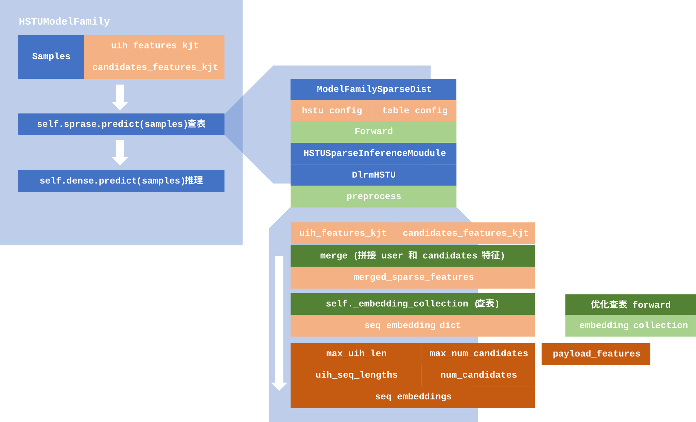

---
title: "HSTU Embedding 学习笔记" 
date:  2026-02-13
draft: false
tags:   [LLM, note]
math:  true
---

## Torchrec

### 数据结构

#### [`JaggedTensor`](https://meta-pytorch.org/torchrec/datatypes-api-reference.html#torchrec.sparse.jagged_tensor.JaggedTensor) (`jt`)

"Jagged" 的意思是 "锯齿状的"，顾名思义，这种 Tensor 每一行的长度不一，可以将长度差异大的特征高效存储为一个 batch，避免 padding 造成资源浪费。如，可以将不同用户的交互历史作为一个 batch，放进 `JaggedTensor` 中存储。

```py
# 存储用户交互历史:
# - User 1 交互了 2 个物品
# - User 2 交互了 3 个物品
# - User 3 交互了 1 个物品

# lengths 给出每个用户交互历史的长度:
# - User 1 交互历史长度为 2
# - User 2 交互历史长度为 3
# - User 3 交互历史长度为 1
lengths = torch.tensor([2, 3, 1], dtype=torch.int32)

# offsets 给出每个用户交互历史的区间: 
# - User 1 的交互历史在 values[0:2]
# - User 2 的交互历史在 values[2:5]
# - User 3 的交互历史在 values[5:6]
offsets = torch.tensor([0, 2, 5, 6], dtype=torch.int32)  

# 实际存储的是一个一维的 Tensor，通过划分来达到变长的效果
values = torch.Tensor([101, 102, 
                       201, 202, 203, 
                       301])  

jt = JaggedTensor(lengths=lengths, values=values)
print(jt)
jt = JaggedTensor(offsets=offsets, values=values)
print(jt)

values_list = jt.to_dense() # 转为 list of tensors
print(values_list)
```

outputs:

```cmd
JaggedTensor({
    [[101.0, 102.0], [201.0, 202.0, 203.0], [301.0]]
})

JaggedTensor({
    [[101.0, 102.0], [201.0, 202.0, 203.0], [301.0]]
})

[tensor([101., 102.]), tensor([201., 202., 203.]), tensor([301.])]
```

#### [`KeyedJaggedTensor`](https://meta-pytorch.org/torchrec/datatypes-api-reference.html#torchrec.sparse.jagged_tensor.KeyedJaggedTensor) (`kjt`)

可以理解为多个 `jt` 的集合，同时给每个 `jt` 分配了一个标签，便于区分和访问。可以用来存储不同类别的的特征。

隐含假设：不同组特征之间是一一对应的，比如一组 `user_features` 对应一组 `item_features`，会自动平均划分，所以不需要指定 `lengths` 或者 `offsets` 中的元素对应哪组特征。

```python
keys = ["user_features", "item_features"] # 定义标签，特征包括用户特征和物品特征

# - 用户特征: 3 个用户，交互记录长度分别为 2, 0, 3
# - 物品特征: 3 个物品，特征长度分别为 1, 2, 1
lengths = torch.tensor([2, 0, 3, 1, 2, 1], dtype=torch.int32)
values = torch.Tensor([11, 12, 21, 22, 23, 101, 201, 202, 77])
# Create a KeyedJaggedTensor
kjt = KeyedJaggedTensor(keys=keys, 
                        lengths=lengths, 
                        values=values)

print(kjt)
# 通过 keys 访问不同特征
print(kjt["user_features"])
print(kjt["item_features"])

print('batch size:', kjt.stride())  # 获取批次大小
```

outputs:

```cmd
KeyedJaggedTensor({
    "user_features": [[11.0, 12.0], [], [21.0, 22.0, 23.0]],
    "item_features": [[101.0], [201.0, 202.0], [77.0]]
})

JaggedTensor({
    [[11.0, 12.0], [], [21.0, 22.0, 23.0]]
})

JaggedTensor({
    [[101.0], [201.0, 202.0], [77.0]]
})

batch size: 3
```

### 模型

#### [`torch.nn.Embedding`](https://docs.pytorch.org/docs/stable/generated/torch.nn.modules.sparse.Embedding.html)

这是 `torch` 中的 Embedding 层，可以用 `nn.Embedding(num_embeddings, embedding_dim)` 定义一个词表大小为 `num_embeddings` ，嵌入维度为 `embedding_dim` 的 Embedding 层。

```python
# an Embedding module containing 10 tensors of size 3
embedding = nn.Embedding(10, 3) # 初始权重是随机的
# a batch of 2 samples of 4 indices each
input = torch.LongTensor([[1, 2, 4, 5], [4, 3, 2, 9]])
embedding(input)
```

outputs:

```cmd
tensor([[[-0.0251, -1.6902,  0.7172],
         [-0.6431,  0.0748,  0.6969],
         [ 1.4970,  1.3448, -0.9685],
         [-0.3677, -2.7265, -0.1685]],

        [[ 1.4970,  1.3448, -0.9685],
         [ 0.4362, -0.4004,  0.9400],
         [-0.6431,  0.0748,  0.6969],
         [ 0.9124, -2.3616,  1.1151]]])
```

#### [`EmbeddingCollection`](https://meta-pytorch.org/torchrec/modules-api-reference.html#torchrec.modules.embedding_modules.EmbeddingCollection) (EC)

这个可以看作是 `torch.nn.Embedding` 的升级版，给每组特征搭上了标签。具体地，传入 `kjt` ，得到 embedding 。

```python
e1_config = EmbeddingConfig(
    name="t1", embedding_dim=3, num_embeddings=10, feature_names=["f1"]
)
e2_config = EmbeddingConfig(
    name="t2", embedding_dim=3, num_embeddings=10, feature_names=["f2"]
)

ec = EmbeddingCollection(tables=[e1_config, e2_config])

#     0       1        2  <-- batch
# 0   [0,1] None    [2]
# 1   [3]    [4]    [5,6,7]
# ^
# feature

features = KeyedJaggedTensor.from_offsets_sync(
    keys=["f1", "f2"],
    values=torch.tensor([0, 1,                  2,    # feature 'f1'
                            3,      4,    5, 6, 7]),  # feature 'f2'
                    #    i = 1    i = 2    i = 3   <--- batch indices
    offsets=torch.tensor([
            0, 2, 2,       # 'f1' bags are values[0:2], values[2:2], and values[2:3]
            3, 4, 5, 8]),  # 'f2' bags are values[3:4], values[4:5], and values[5:8]
)

feature_embeddings = ec(features)
print(feature_embeddings)
print('------------------')
print('### f1 feature')
print(feature_embeddings["f1"].offsets())
print(feature_embeddings["f1"].values())
print('### f2 feature')
print(feature_embeddings["f2"].offsets())
print(feature_embeddings["f2"].values())
```

outputs:

```cmd
{'f1': <torchrec.sparse.jagged_tensor.JaggedTensor object at 0x7f7eb1ab2150>, 'f2': <torchrec.sparse.jagged_tensor.JaggedTensor object at 0x7f7eb1ab1d30>}
------------------
### f1 feature
tensor([0, 2, 2, 3])
tensor([[ 0.0548,  0.1086,  0.0119],
        [ 0.0635,  0.1062, -0.2560],
        [-0.2143, -0.0599, -0.2480]])
### f2 feature
tensor([0, 1, 2, 5])
tensor([[ 0.2697,  0.1827, -0.0657],
        [-0.1316, -0.2873,  0.3116],
        [-0.0632, -0.1552, -0.0938],
        [-0.3044,  0.0939,  0.0486],
        [ 0.1156, -0.0385,  0.0146]])
```

#### [`torch.nn.EmbeddingBag`](https://docs.pytorch.org/docs/stable/generated/torch.nn.modules.sparse.EmbeddingBag.html)

这是 Embedding + pooling 层，pooling 模式有 `sum`, `mean`, `max`, 默认为 `mean` 。传入一个 batch 后，会查表计算出每个序号的 embedding，然后进行 pooling，不会保存中间状态。

```py
# an EmbeddingBag module containing 10 tensors of size 3
embedding_sum = nn.EmbeddingBag(10, 3, mode='sum')
# a batch of 2 samples of 4 indices each
input = torch.tensor([1, 2, 4, 5, 4, 3, 2, 9], dtype=torch.long)
offsets = torch.tensor([0, 4,], dtype=torch.long)
print(embedding_sum(input, offsets))

input = torch.tensor([[1, 2, 4, 5], [4, 3, 2, 9]], dtype=torch.long)
print(embedding_sum(input))
```

outputs:

```cmd
tensor([[-0.8861, -5.4350, -0.0523],
        [ 1.1306, -2.5798, -1.0044]])
tensor([[-0.8861, -5.4350, -0.0523],
        [ 1.1306, -2.5798, -1.0044]])
```

这里支持 `offsets` 参数，使用起始位置来划分每个 batch。所以可以传入 2D 的 `inputs` ，也可以传入 1D 的 `inputs` + `offsets` 。

#### [`EmbeddingBagCollection`](https://meta-pytorch.org/torchrec/modules-api-reference.html#torchrec.modules.embedding_modules.EmbeddingBagCollection) (`EBC`)

这个可以看作是 `torch.nn.EmbeddingBag` 的升级版。可以根据 `featrue_names` 对特征进行池化。具体地，传入 `kjt` ，前向传播得到池化后的特征。

```py
table_0 = EmbeddingBagConfig(
    name="t1", embedding_dim=3, num_embeddings=10, feature_names=["f1"]
)
table_1 = EmbeddingBagConfig(
    name="t2", embedding_dim=4, num_embeddings=10, feature_names=["f2"]
)

ebc = EmbeddingBagCollection(tables=[table_0, table_1])

#        i = 0     i = 1    i = 2  <-- batch indices
# "f1"   [0,1]     None      [2]
# "f2"   [3]       [4]     [5,6,7]
#  ^
# features

features = KeyedJaggedTensor(
    keys=["f1", "f2"],
    values=torch.tensor([0, 1,                  2,    # feature 'f1'
                            3,      4,    5, 6, 7]),  # feature 'f2'
                    #    i = 1    i = 2    i = 3   <--- batch indices
    offsets=torch.tensor([
            0, 2, 2,       # 'f1' bags are values[0:2], values[2:2], and values[2:3]
            3, 4, 5, 8]),  # 'f2' bags are values[3:4], values[4:5], and values[5:8]
)

pooled_embeddings = ebc(features)
print(pooled_embeddings)
print(pooled_embeddings.values())
print(pooled_embeddings.keys())
print(pooled_embeddings.offset_per_key())
```

outputs:

```cmd
KeyedTensor({
    "f1": [[-0.05368266999721527, -0.49714457988739014, 0.027471214532852173], [0.0, 0.0, 0.0], [-0.09605476260185242, -0.30402711033821106, -0.013938307762145996]],
    "f2": [[-0.20428268611431122, -0.25504255294799805, 0.23750828206539154, 0.3035320043563843], [0.057708702981472015, 0.14746926724910736, 0.05408177152276039, -0.2895013391971588], [-0.010172609239816666, -0.01704445481300354, -0.07303650677204132, 0.3184009790420532]]
})

tensor([[-0.0537, -0.4971,  0.0275, -0.2043, -0.2550,  0.2375,  0.3035],
        [ 0.0000,  0.0000,  0.0000,  0.0577,  0.1475,  0.0541, -0.2895],
        [-0.0961, -0.3040, -0.0139, -0.0102, -0.0170, -0.0730,  0.3184]],
       grad_fn=<CatBackward0>)
['f1', 'f2']
[0, 3, 7]
```

## HSTU Embedding



