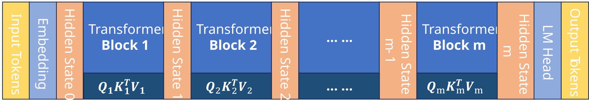
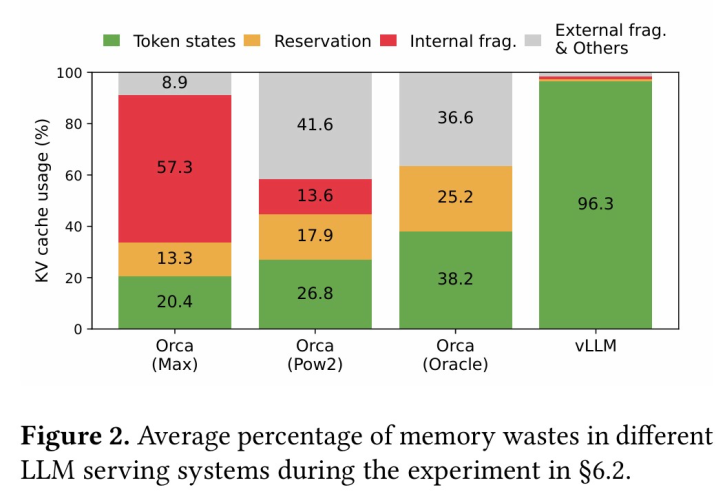

# 什么是 vLLM

**vLLM, virtual Large Language Model**, 是一个高性能、低延迟的大模型推理和部署库。目的是加速模型推理，并节省显存。其核心创新是 **PagedAttention** 机制。

>之前总是把模型的训练和推理混为一谈，但实际上区别还是有的。虽然两者都要进行前向传播计算，但是训练还要反向传播，而推理则更加纯粹。此外，推理面对的是更具体的落地应用场景，有高并发、大批量等需求，因此优化推理过程意义很大。

# LLM 推理回顾：KV Cache 引入

要优化推理，首先要知道推理的过程是怎么样的。

众所周知当下主流 LLM 都是 **自回归** 的，即：将 prompt 作为输入，预测下一个词，然后拼接预测结果到 prompt 末尾，作为新的 prompt，继续预测下一个词，直到输出结束标志为止。

我们可以将这个过程分为两个部分：**Prefill** 和 **Decoding**。

## Prefill

在这一阶段，用户给出一个完整的 $\text{prompt} = \{x_1, x_2, \ldots, x_n\}$，模型需要对这个 prompt 进行前向传播计算，预测下一个词 $x_{n+1}$。

这一部分其实和训练时的前向传播是一样的，只不过不需要计算 loss 和进行反向传播。下图是一个具有 $m$ 个 Transformer 层的模型的前向传播示意图：

<figure style="text-align: center;">
    
    <figcaption style="color: grey; font-size: 0.9em; text-align: center;">
		LLM 结构
    </figcaption>
</figure>

这里，Input Tokens 是 ${x_1, x_2, \ldots, x_n}$，Output Tokens 是 ${x'_2, x'_3, \ldots, x'_{n+1}}$。在训练的时候，我们会计算 Output Tokens 和真实的 ${x_2, x_3, \ldots, x_{n+1}}$ 之间的 loss。但是在推理时，我们只需要取最后一个输出 $x'_{n+1}$ 作为预测结果。

既然 $n$ 个 output token 中，我们只需要一个，有没有办法优化呢。其实是可以略微优化一点点。只需要最后一个 output token，说明我们只需要最后一层隐藏状态中的 $\text{HiddenState}_{m, n}$ ，于是我们的 $Q_m = [q_{m, 1}, q_{m, 2}, \cdots, q_{m, n}] ^ T$ 只用保留 $q_{m, n}$ 这一个向量就可以了，但是除此之外 $K_m,\ V_m$ 还是需要全部保留。又由于 $K_m$ 和 $V_m$ 依赖于该层输入的所有隐藏状态，因此我们还是需要保留所有层的所有隐藏状态和相应的 $Q,K, V$。

那么，这一阶段的前向传播要点就是，除了最后一层 Transformer 的 $Q$ 可以简化之外，前面所有层都要完整地计算 $QK^TV$ 并得到所有隐藏状态。但实际上很多时候，这样的小优化意义不大，因此我们可以将其视为所有层都完整地计算了 $QK^TV$ 和对应的隐藏状态。

## Decoding

在这一阶段，模型开始进行自回归生成，即每次把上一步预测的词拼接到 prompt 末尾，作为新的输入，继续预测下一个词。这个过程会持续多次，直到生成结束标志为止。

假如现在我预测 $x'_{n+1}$ ，那么同样地，我们可以从末尾先追踪回去，看看需要哪些隐藏状态和 $Q, K, V$。事实上，我们发现关键是每一层的隐藏状态要出来。既然我们之前已经把前面 token 的每一层隐藏状态都算过了，那么只需补齐 $x_n$ 在每一层的隐藏状态。这样，在每一层的 Transformer 中，我们都只需用到一个 $q$ 向量来参与计算。进一步地，既然保存隐藏状态是为了计算 $K$ 和 $V$，那么我们直接一步到位，把 $K$ 和 $V$ 给保存下来就行了。

到这里已经比较清晰，我们可以通过缓存每一层 Transformer 的 $K$ 和 $V$ 方式来避免重复计算。推理时，在每一层计算当前 token 对应的 $q$ ，然后和缓存的 $K$ 和 $V$ 做注意力计算，得到当前层的输出即可。

这种缓存机制则被称为 **KV Cache** 。KV Cache 用显存换取了计算速度，大大加速了自回归生成的过程。

# PagedAttention：解决显存分配问题

## KV Cache 带来的显存分配问题

虽然我们通过 KV Cache 加速了推理过程，但是也带来了显存分配的问题。这是因为 KV Cache 是动态的，随着生成的进行，缓存的 $K$ 和 $V$ 会不断增长；KV Cache 也是未知的，我们无法预知最终会生成多少 token。在 vLLM 之前，大多数推理框架的策略都是按照 max_token 来预分配一段连续的显存空间给每一个推理请求，但这无疑会造成显存碎片化和显存浪费等问题。

<figure style="text-align: center;">
    
    <figcaption style="color: grey; font-size: 0.9em; text-align: center;">
		显存使用情况对比 (来源: vLLM 论文 https://arxiv.org/abs/2309.06180)
    </figcaption>
</figure>

如上图所示，Token states 表示实际使用的显存；Reservation 表示预分配且实际使用的显存；Interal Frag. 表示预分配但未使用的显存；External Frag. 表示未使用且未预分配的显存，可以理解为连续显存之间的空隙。传统方法显存利用率极低，而 vLLM 利用率则高得多。

vLLM 之所以能有效地解决显存分配问题，关键在于其提出的 **PagedAttention** 机制。

## PagedAttention 机制

