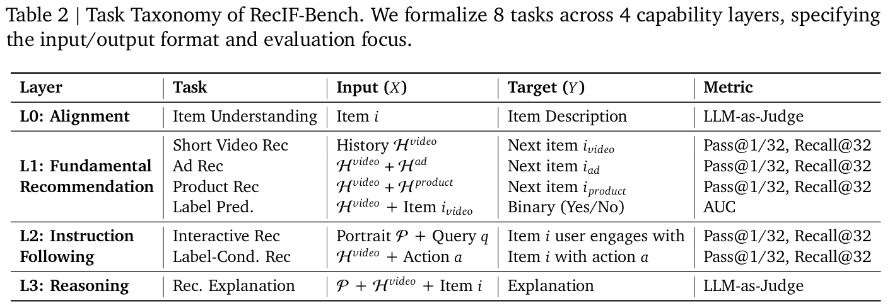
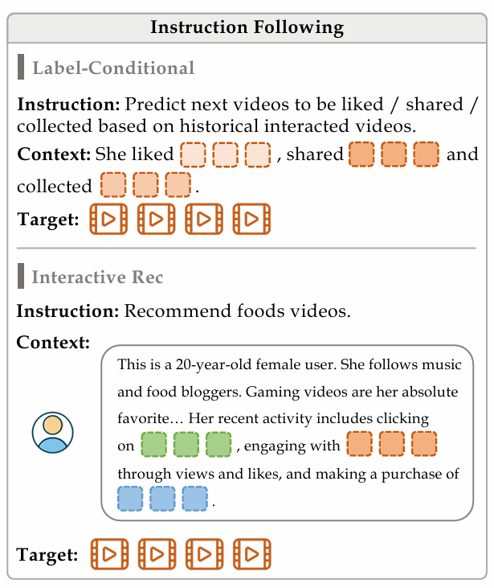

# OpenOneRec 论文阅读笔记

## 0

> 原文：[OpenOneRec Technical Report](https://arxiv.org/abs/2512.24762)

- 尽管 OneRec 系列已将散乱的推荐算法 pipeline 统一成了一个 end-to-end 的推荐系统框架。但是推荐系统和生成式智能之间仍然有 a huge gap: **Isolated Data (孤立数据)**.

- Isolated Data 可以理解为推荐系统和生成式智能在数据使用上的差异。推荐系统中的数据，如用户行为数据、物品属性数据等，这些数据往往是结构化的、离散的，并且与具体的推荐任务紧密相关，重要的是缺乏相关的语义信息。同时也可以指不同平台之间的数据隔离。

- 而生成式智能（如大语言模型）则主要依赖于海量的文本数据，这些数据通常是非结构化的，包含丰富的语义信息，能够捕捉到语言的复杂性和多样性。

- 因此推荐系统的模型虽然能够在特定任务上表现出色，但往往缺乏世界知识、语义理解和推理能力，难以生成高质量的内容，限制了模型的泛化能力和适应性。

- 此外 OneRec Team 还认为，这个 gap 的产生也是因为缺乏一个统一的 benchmark 来评估和比较推荐系统在生成式智能任务上的表现，从而阻碍了该领域的研究和发展。

- 为了弥合这个 gap，OneRec Team 的贡献如下：

    1. **RecIF-Bench & OpenData**: 一个统一的 benchmark， 覆盖 8 种任务，用来衡量从基础推荐到复杂推理的能力。
    2. **Framework & Scaling**: 开源了 OpenOneRec 框架，并且展示了生成式推荐系统在大规模训练下的潜力。
    3. **SOTA Results**: 在多个任务上达到了 SOTA 结果，展示了生成式推荐系统的强大能力。

## 1 Items as Tokens

### 1.1 Itemic Tokens

> 推荐系统的一个基本挑战是：离散物品特征 (items) 与连续文本特征 (tokens) 之间的失配。

- 朴素的想法是：使用长文本描述来替代 items，但存在两个问题：
  1. 上下文过长
  2. 可能会生成不存在的 items
- OneRec Team 的想法是：将 items 视作一种特殊的 token：**Itemic Tokens** ，其特点是：
  1. **长度短 (short):** 确保模型在长上下文上的效率。
  2. **长度固定 (fixed-length sequences):** 保持 token-item 的协作结构固定。
  3. **分层离散代码 (hierarchical discrete codes):** 确保语义相近的 items 拥有相同的前缀，让模型易于理解。

### 1.2 计算方法: Residual-Quantized Code, RQ Code

> 参考文章：[QARM: Quantitative Alignment Multi-Modal Recommendation at Kuaishou](https://arxiv.org/abs/2411.11739)

#### 对比学习

- 我们希望构造一个数据集 $D$ ，里面包含若干个物品对，表示这些物品之间是相似的。

- 可以用现有模型或方法从两方面提取

    - **User2Item:** 当用户点击了 $A$，并且是正向的，那么从用户最近点击的 50 个正向物品中，选一个与 $A$ 最相似的物品 $B$，构造相似物品对 $(A, B)$ 加入 $D$  中。

    - **Item2Item:** 使用现有方法（如 Swing retrieval model），可以直接提取出若干相似物品对加入  $D$ 。

- 这样，对于一个 Batch 的物品，我们就可以用对比学习的方式训练一个编码器，将物品 id 嵌入（embed）到高维空间中。

#### RQ Code

- 现在对于一个物品，我们存在一个 id 到高维向量的映射，但是直接拿这个高维向量当作 token 还是不好，因为稀疏、噪声大等问题？总之推荐模型更适配离散 id 风格的特征。

- 所以我们假设现在的特征为 $X\in \mathbb{R}^{N\times D}$ ，表示有 $N$ 个物品，每个物品 $D$ 维的特征。

- 首先设定一超参数 $L$ 。选择 $L$ 个聚类中心进行 K-means 聚类。
- 聚类完成后，每个物品选择离他最近的聚类中心的编号作为第一层编号。
- 接着，每个物品减去第一层聚类中心，得到残差。然后对残差进行第二层 K-means 聚类，得到第二层编号。

- 重复上述过程 $L$ 层，最终每个物品会得到 $L$ 个编号，组成一个长度为 $L$ 的序列，作为该物品的 RQ Code。

- RQ Code 可以理解为前几层负责捕捉物品的全局语义，后几层负责捕捉细节。

##  2 推荐系统的自回归模型

> 当 items 对齐到 token 空间之后，我们的词表变为 $V = V_{text} \cup V_{item}$ 。这样我们可以将用户的交互历史直接视作一个长文本序列，而非特殊的结构化数据，从而可以使用自回归的方式解决问题。

- 指令 (Instruction) : $I$

- 用户历史 (User History) : $C$

- 最小化以下损失函数：
    $$
    L(\theta) = -\sum_{t=1}^{|Y|} \log P_\theta(y_t | I, C, y_{<t})
    $$

- 其中 $Y$ 是目标推荐序列或者自然语言文本，这取决于具体任务。

- 该模式让我们得以利用现有的强大语言模型 (LLM) 来处理任务。

## 3 RecIF-Bench

### 3.1 数据构成

- 包含来自 20 万用户的 1.2 亿条交互数据。
- 包含短视频 (Short Video), 广告 (Ad), 商品 (Product) 三类 items 的数据。
  - **Short Video:** 提供曝光序列 (impression sequences) 以及对应的交互类型 (interaction type).
  - **Ad:** 这对于带有产品链接的短视频而言的，提供用户的点击序列 (click sequences).
  - **Product:** 提供用户的点击序列 (click sequences).
- 包含丰富的元数据：
  - **User-side:** 一段结合了自然语言 token 和 itemic token 的叙述作为用户画像，包括年龄、性别、最近浏览、购物记录等等信息。
  - **Item-side:** （在数据集找了一圈，不是很清楚这个 embedding 放哪了）
    - 4096 维文本 embedding
    - 5 帧的视觉 embedding，每帧 1152 维
    - 对视频详细的文本描述 (dense caption)。
  - **Interaction-side:** 对于每个 user-video 对，提供交互类型，包括 like, follow, comment, effective view, dislike.
- 对于每个 item 都提供了对应的 RQ-code 。

- 以用户维度划分 train-test set，对于一个用户，以时间维度划分 history-target 。

### 3.2 任务设计

<figure style="text-align: center;">
    
    <figcaption style="color: grey; font-size: 0.9em; text-align: center;">
		来源: https://arxiv.org/abs/2512.24762)
    </figcaption>
</figure>

- 如表，按能力的高级程度，一共划分了四个层次，共 8 个任务。

- $H$ 表示交互历史，$P$ 表示用户画像。

- L0, L1, L3 看表格就很好理解，解释一下 L2 的两个任务
<figure style="text-align: center;">
    
    <figcaption style="color: grey; font-size: 0.9em; text-align: center;">
		L2 任务示例，来源: https://arxiv.org/abs/2512.24762)
    </figcaption>
</figure>

- 评测指标说明：

  - LLM-as-Judge: 使用 LLM 评判输出与答案的相似度。

  - Pass @ K: 表示生成的前 $K$ 个目标命中 Ground Truth 中的 items 占预测次数的比例。

  - Recall @ K: 表示每次考虑前 $K$ 个目标的前提下，Ground Truth 中被命中的比例。

  - > 注意：一条指令中，Ground Truth 是一个集合，包含多个 items。所以是给出一个历史集合，预测 items 去击中一个 target 集合。

- 此外还补充了一些之前就有的 benchmark 的测试，包括数学、编程等等，用来检验模型对其它任务的泛化性。

- 详细的还是要自己去 hf 上看，有很清晰的文档，论文里写的有点泛了感觉。
  [OpenOneRec/OpenOneRec-RecIF · Datasets at HF Mirror](https://hf-mirror.com/datasets/OpenOneRec/OpenOneRec-RecIF)

## 4 Pre-Training

### 4.1 Pre-Training Data

> 论文的附录提供了预训练数据的示例，非常的直观哦。o(*￣▽￣*)ブ

- **Itemic Token**
  - items，使用 RQ-Code 表示，共三层 $S_i = (s_a,s_b,s_c)$ ，每层码表大小为 8192 （即 8192 个聚类中心）。
  - 转换为 token:  `<|item_begin|><item_a_5028><item_b_6733><item_c_2559><|item_end|>`
- **Itemic Dense Caption Data**
  - 训练一个模型，输入 Itemic Token，输出相应的文字描述，形成物品的文字描述数据。
- **Swquential User Behavior Data**
  - 字面意思，这是 core training corpus 。
- **Interleaved User Persona Grounding Data**
  - 将 item 和用户的各种行为（性别年龄、交互历史等等）结合起来构成用户画像数据。

---

> 作者: [kiraa](https://github.com/kcccn)  
> URL: https://kiraa-blog.vercel.app/post/learning_openonerec/  

